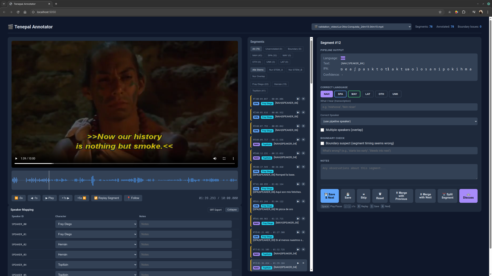

# Tenepal

**Phoneme-based language identification for Nahuatl-first evaluation in film audio.**

Tenepal identifies *what language* is being spoken in audio, with the current public-facing evaluation focused on **Nahuatl vs. Spanish**. It works by analyzing the raw phoneme stream via universal phoneme recognition and matching against phonotactic profiles, with prosodic fusion as a second evidence channel. Maya support remains exploratory and is not yet presented here as a release-ready benchmark.

> *Tenepal* — associated with Nahuatl senses around "the tongue," eloquence, or facility with words. This project name follows the `Malintzin Tenepal` discussion summarized on the La Malinche page and the scholarship cited there, especially Frances Karttunen and James Lockhart. The historical *tenepal* mediated between languages and cultures in conquest-era Mesoamerica.

## Key Results

| Metric | Value | Description |
|--------|-------|-------------|
| **Hernán duration-weighted accuracy** | **73.7%** | Best configuration on 550 annotated NAH+SPA segments from `Hernán-1-3` (568s/770s of film time) |
| **Hernán segment accuracy** | **71.6%** | Same benchmark, segment-level (394/550 segments) |
| **NAH precision / recall** | **75.5% / 76.1%** | Nahuatl detection on Hernán benchmark |
| **Cross-film LOC accuracy** | **84.4% raw / 81.7% balanced** | 244 annotated NAH+SPA segments from *La Otra Conquista* (minutes 14-44) |
| **Nahuatl ASR CER** | **108% → 70%** | Whisper-large-v3 baseline vs. LoRA finetune on OpenSLR-92 test sample |

See [PAPER.md](PAPER.md) for the full technical write-up, [docs/AMITH_CORPORA.md](docs/AMITH_CORPORA.md) for corpus access instructions, and [EVOLUTION.md](EVOLUTION.md) for the research journal.

Metric provenance:

- `73.7%` duration-weighted and `71.6%` segment accuracy are the canonical Hernán benchmark numbers, evaluated with `evaluate.py` using cue-index matching against the annotator DB as ground truth (v2 snapshot, 550 NAH+SPA segments). Duration weighting reflects how much film time is correctly classified, avoiding equal weight for 0.3s interjections and 15s monologues.
- `84.4% raw / 81.7% balanced` comes from the annotated `La Otra Conquista` subset (5 clips, 244 NAH+SPA segments). GT snapshot: [`benchmarks/snapshots/loc_gt_v2.json`](benchmarks/snapshots/loc_gt_v2.json), methodology in [PAPER.md](PAPER.md).
- `108% -> 70%` CER is the current public draft finetuning result from [PAPER.md](PAPER.md), based on OpenSLR-92 test sampling.

## Installation

```bash
pip install -e .
```

Optional dependencies for the full pipeline:

```bash
pip install -e ".[diarization]"    # pyannote.audio speaker diarization
pip install -e ".[g2p]"            # epitran grapheme-to-phoneme
pip install -e ".[transcription]"  # faster-whisper ASR
pip install praat-parselmouth      # prosody analysis
pip install demucs                 # vocal isolation
```

## Quick Start

```bash
# Process audio file → SRT with language tags
tenepal batch input.wav --output output.srt

# Process with speaker diarization
tenepal batch input.wav --output output.srt --diarize

# Full pipeline with Whisper transcription
tenepal process input.wav --output output.srt --whisper-model small

# Live system audio capture
tenepal live

# Diagnostic: analyze phoneme distribution
tenepal analyze input.wav

# Docker GPU setup (for pyannote diarization)
tenepal setup-docker
tenepal doctor
```

## Cloud Backends

Tenepal supports pluggable cloud compute for GPU-intensive pipeline stages:

```bash
# Modal (default)
modal run tenepal_modal.py::main --input audio.wav

# RunPod
TENEPAL_RUNTIME=runpod tenepal process audio.wav

# Docker (local GPU)
tenepal batch audio.wav --docker
```

The runtime provider abstraction (`src/tenepal/runtime/`) auto-detects available backends or can be configured via `TENEPAL_RUNTIME` environment variable.

## Architecture

```
src/tenepal/
├── audio/            # Audio loading, format conversion, preprocessing
├── phoneme/          # Universal phoneme recognition (Allosaurus + text-to-IPA)
├── language/         # Language identification (profiles, scoring, smoothing)
├── transcription/    # Whisper integration and transcription routing
├── speaker/          # Speaker diarization (host + Docker backends)
├── prosody/          # Prosodic feature extraction (F0, rhythm)
├── fusion/           # Multi-evidence score fusion
├── preprocessing/    # Demucs vocal isolation, VAD segmentation
├── pronunciation/    # IPA → familiar-spelling rendering
├── morphology/       # Morphological analysis
├── orchestration/    # End-to-end pipeline orchestration
├── runtime/          # Cloud provider abstraction (Modal, RunPod)
├── validation/       # Scoring and evaluation framework
├── subtitle/         # SRT generation with language tags
├── docker/           # Docker GPU container utilities
├── data/             # Language profiles, epitran maps, lexicons
├── pipeline.py       # Core pipeline orchestration
└── cli.py            # Command-line interface
```

### Pipeline Flow

```
Audio → ffmpeg → Demucs (vocal isolation) → Silero-VAD (segmentation)
  → per segment:
      Allosaurus → IPA → Phonotactic scoring ─┐
      Parselmouth → Prosody features ──────────┤→ Score fusion → Language ID
      Whisper → text (if language known) ──────┘
  → Speaker diarization (pyannote) → Speaker-level smoothing
  → SRT with [NAH|85%], [SPA|92%], [MAY|78%] language tags
```

## EQ Configuration

The pipeline is tunable via JSON EQ config files that control scoring thresholds, fusion weights, and detection gates:

```bash
tenepal process audio.wav --eq eq_custom.json
```

See `eq_default.json` for all available parameters.

## Tools

| Tool | Path | Description |
|------|------|-------------|
| **Annotator** | `tools/annotator/` | Web-based annotation tool for ground-truth labeling |
| **Evaluation** | `evaluate.py` + `tools/corpus/` | Scoring scripts, corpus evaluation, hallucination statistics |
| **Regression** | `tools/regression/` | Clip-based regression test harness |
| **Corpus** | `tools/corpus/` | AMITH Zacatlan-Nahuatl corpus integration |

Public-facing support docs:

- [docs/AMITH_CORPORA.md](docs/AMITH_CORPORA.md) — where to get the Amith corpora and how local download works
- [docs/ANNOTATOR_SCREENSHOTS.md](docs/ANNOTATOR_SCREENSHOTS.md) — guidance for safe public annotator screenshots
- [docs/OPEN_PROBLEMS.md](docs/OPEN_PROBLEMS.md) — current highest-priority unresolved technical problems

## Annotator



`Tenepal Annotator` for segment-level review of Nahuatl/Spanish predictions on *La Otra Conquista*.

## Research

- [PAPER.md](PAPER.md) — Technical paper: methodology, experiments, results
- [EVOLUTION.md](EVOLUTION.md) — Research journal: experiments, failures, and lessons learned chronologically

## Datasets

Current release emphasis:

- **Hernán (2019)** — the original project trigger and the main ablation benchmark; access is region-dependent and clips are not redistributed
- **La Otra Conquista (1999)** — the culturally better public-facing Nahuatl/Spanish reference for external verification
- **OpenSLR 92 Puebla-Nahuatl** — training/evaluation corpus for Whisper finetuning
- **OpenSLR 147/148 + related lexical sources** — auxiliary Nahuatl corpus and lexicon sources
- **Apocalypto / Maya materials** — exploratory only; not yet a release-ready benchmark

Important release note: this repository does **not** grant rights to redistribute film audio, video, or subtitle files. The exact scenes used in experiments are documented in [PAPER.md](PAPER.md) for reproduction using lawfully obtained source media.

Project framing note: Marina/Malinche remains the symbolic avatar of the project because of her role as a linguistic mediator in the conquest era, even though she does not directly appear in *La Otra Conquista*.

Source notes:

- Malintzin / Tenepal naming discussion: https://en.wikipedia.org/wiki/La_Malinche
- OpenSLR 92: https://openslr.org/92/
- OpenSLR 147: https://openslr.org/147/
- OpenSLR 148: https://openslr.org/148/

## License

MIT License. See [LICENSE](LICENSE).

## Citation

```bibtex
@software{tenepal2026,
  title={Tenepal: Phoneme-Based Language Identification for Endangered Languages},
  author={Dresch, Markus},
  year={2026},
  url={https://github.com/markusdresch/tenepal}
}
```

---

*Per ardua ad astra. Built for languages the world forgot to support.*
